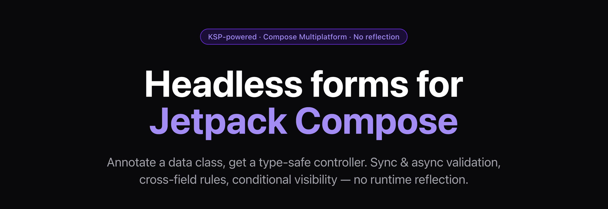

# Formidable

<p align="center">
  
</p>

[](https://central.sonatype.com/search?q=com.wassimbeltaief.formidable)
[](https://github.com/WassimBeltaief/Formidable/actions/workflows/ci.yml)
[](https://codecov.io/gh/WassimBeltaief/Formidable)
[](LICENSE)
[](https://kotlinlang.org)
[](https://www.jetbrains.com/kotlin-multiplatform/)
[](https://www.jetbrains.com/lp/compose-multiplatform/)

Formidable generates type-safe form controllers from annotated Kotlin data classes. Define your form once — get state management, validation, and Compose integration on Android, iOS, and Web.

| | Manual Compose | Formidable |
|---|---|---|
| **State management** | ❌ `remember` + `mutableStateOf` per field | ✅ Generated `StateFlow<FieldState<T>>` |
| **Validation** | ❌ Write it yourself 😩 | ✅ `@Email` `@MinLength` `@NotBlank` `@Pattern`… 🎯 |
| **Async validation** | ❌ Coroutines, debounce, state — all manual 😵 | ✅ `@AsyncValidation` ⚡ |
| **Cross-field rules** | ❌ Wire fields together manually 🤯 | ✅ `@MatchField` `@RequiredIf` `@VisibleWhen` 🔗 |
| **Focus & keyboard** | ❌ `FocusRequester`, `KeyboardOptions`, `ImeAction` 😤 | ✅ Auto-wired, `Tab` / `Done` handled 🎹 |
| **Error display** | ❌ Manual `isError` + `supportingText` per field | ✅ Auto-rendered with config DSL overrides ✨ |
| **Rendering** | ❌ All UI from scratch | ✅ Headless or auto-render M3 — your choice 🎨 |
| **Code generation** | ➖ | ✅ KSP at compile time, zero reflection 🚀 |
| **Multiplatform** | ➖ | ✅ Android · iOS · Web (Compose Multiplatform) 🌍 |

## Try it live

> **[wassimbeltaief.github.io/Formidable](https://wassimbeltaief.github.io/Formidable/)** — interactive demo running in the browser

---

## Quick Start

Three steps. That's it.

### 1. Annotate a data class

```kotlin
@FormSchema
data class LoginForm(
    @Field(label = "Email")
    @Email
    val email: String = "",

    @Field(label = "Password")
    @MinLength(8)
    val password: String = "",
)
```

### 2. Use the generated controller

KSP generates `LoginFormController` — no boilerplate, no reflection.

```kotlin
class LoginViewModel : ViewModel() {
    val controller = LoginFormController()
}
```

### 3. Build your UI

```kotlin
@Composable
fun LoginScreen(viewModel: LoginViewModel) {
    val emailState by viewModel.controller.email.collectAsState()
    val passwordState by viewModel.controller.password.collectAsState()
    val isValid by viewModel.controller.isValid.collectAsState()

    Formidable {
        StringField(
            state = emailState,
            onValueChange = { viewModel.controller.updateEmail(it) },
            onFocusLost = { viewModel.controller.touchEmail() },
        )
        StringField(
            state = passwordState,
            onValueChange = { viewModel.controller.updatePassword(it) },
            onFocusLost = { viewModel.controller.touchPassword() },
            config = {
                visualTransformation = PasswordVisualTransformation()
                keyboardType = KeyboardType.Password
            },
        )
        Button(onClick = { /* submit */ }, enabled = isValid) {
            Text("Login")
        }
    }
}
```

Formidable renders `OutlinedTextField` for you, auto-wires focus, keyboard navigation, and error display. Need a different style or a password field? Use `config = { ... }`. Need full control? Pass a trailing lambda instead.

---

## Installation

### Android (Jetpack Compose)

```kotlin
// build.gradle.kts
plugins {
    id("com.google.devtools.ksp") version "2.1.0-1.0.29"
}

dependencies {
    implementation("com.wassimbeltaief.formidable:formidable-core:2.0.1")
    implementation("com.wassimbeltaief.formidable:formidable-compose:2.0.1")
    ksp("com.wassimbeltaief.formidable:formidable-ksp:2.0.1")
}
```

### Kotlin Multiplatform (Compose Multiplatform)

KSP in KMP runs against `commonMain` metadata, which requires a small amount of extra wiring to make the generated sources visible to all targets.

```kotlin
// build.gradle.kts
plugins {
    id("com.google.devtools.ksp") version "2.1.0-1.0.29"
}

kotlin {
    sourceSets {
        commonMain.dependencies {
            implementation("com.wassimbeltaief.formidable:formidable-core:2.0.1")
            implementation("com.wassimbeltaief.formidable:formidable-compose:2.0.1")
        }
    }
}

dependencies {
    // KSP processes @FormSchema in commonMain, generates a Controller for all targets
    add("kspCommonMainMetadata", "com.wassimbeltaief.formidable:formidable-ksp:2.0.1")
}

// Ensure KSP metadata runs before any compilation task
tasks.withType<org.jetbrains.kotlin.gradle.tasks.KotlinCompilationTask<*>>().configureEach {
    if (!name.startsWith("ksp")) {
        dependsOn("kspCommonMainKotlinMetadata")
    }
}

// Make generated sources visible in commonMain
kotlin.sourceSets.commonMain {
    kotlin.srcDir(layout.buildDirectory.dir("generated/ksp/metadata/commonMain/kotlin"))
}
```

---

## Documentation

| | |
|---|---|
| [In-Depth Guide](GUIDE.md) | Schema → controller, rendering modes, FieldScope, all field types with examples, validation reference |
| [GitHub Pages](https://wassimbeltaief.github.io/Formidable/) | Interactive docs + live demo |
| [Sample App](composeApp/) | Full sign-up form: async validation, cross-field rules, conditional fields, enum dropdown |
| [Changelog](CHANGELOG.md) | Release history |
| [Contributing](CONTRIBUTING.md) | How to contribute |

---

## Roadmap

### Planned modules

| Module | Description |
|---|---|
| `formidable-persistence` | SavedStateHandle + `retain {}` strategies for surviving process death |
| `formidable-wizard` | Multi-step forms: `@Step`, `WizardState`, `FormWizard {}` |
| `formidable-autofill` | Compose 1.8 autofill semantics injection via `@AutofillType` |
| `formidable-showcase` | Live WASM playground on GitHub Pages |

### Enhancements & ideas

- **Password style** — `FieldStyle.Text.Password` that bundles `PasswordVisualTransformation` and an eye-icon toggle
- **Date / time picker** — `DateField` and `TimeField` types with platform-native pickers
- **Character counter** — auto-render shows remaining characters when `@MaxLength` is set
- **Theming** — global default styles for auto-render fields (override `OutlinedTextField` defaults once, apply everywhere)
- **`NullableEnumField` auto-render** — config DSL support for nullable enum fields (currently headless only)
- **Compose Desktop target** — extend CMP support beyond Android + iOS + WASM
- **Form serialization** — `controller.toJson()` / `controller.fromJson()` for draft saving
- **Server error DSL** — `controller.setErrors(mapOf("username" to "Already taken"))` batch API
- **Accessibility** — screen reader semantics and content descriptions wired into auto-render
- **Binary API compatibility** — Kotlin binary compatibility validator in CI
- **Maven Central publishing** — `com.wassimbeltaief.formidable:*` on Maven Central

---

## Contributing

Contributions are welcome! Please read the [contributing guidelines](CONTRIBUTING.md) before submitting a pull request.

## License

[MIT](LICENSE) — Copyright © 2024-present Wassim Beltaief